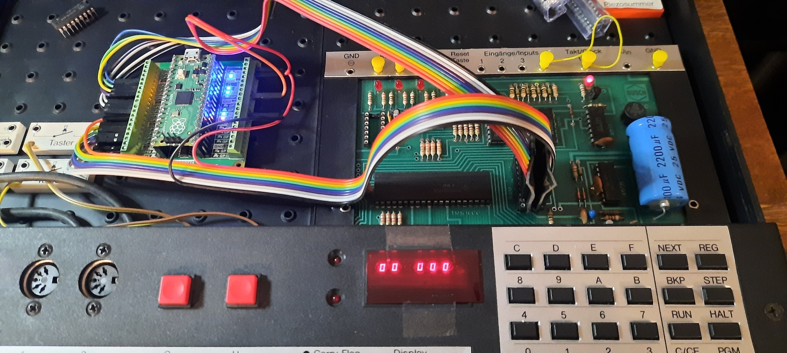

# PicoRAM 2090

A Raspberry Pi Pico (RP2040)-based 2114 SRAM Emulator for the Busch
2090 Microtronic Computer System

 

## About

This emulates the [2114
SRAM](https://de.wikipedia.org/wiki/2114_(SRAM)) found in the [Busch
2090 Microtronic Computer
System](https://github.com/lambdamikel/Busch-2090) - it's a fully
compatible "drop in" replacement.

 

The [2114](manuals/2114.pdf) was a popular and widely used 1024x4 Bit
SRAM chip. It was used in many early arcade games from the late 1970s
and early 1980s. Pinout:

 

The Microtronic is a relatively slow educational 4bit microcomputer,
so timing is not critical. A standard Pico is more than fast enough
for the Microtronic. Note that the Microtronic doesn't utilize the
`CS` (Chip Select) line of the 2114; only `WE` (Write Enable) is used
in addition to the 10 address lines (`A0` to `A9`) and 4 
data lines (`IO/1` to `IO/4`).

 

## Hardware Setup 

The wiring goes as follows:

- `GP2`..`GP11`: address lines `A0`..`A9` (input) 
- `GP12`..`GP15`: data lines `IO/1`..`IO/4` (input/output)
- `GP22`: Write Enable (`WE`), low active (input) 

Simply connect the corresponding Pico `GP` ports to the corresponding
2114 pins; in the original Microtronic, the 2114 is housed in a
special (white) socket, so the chip is easily spotted:

I recommend replacing this socket with a standard DIP socket so that
the PicoRAM 2090 can be connected more easily. I simply used DuPont
cables and a standard (machined) IC 18pin DIP socket; DuPont cables
plug in very firmly and permantely into these.

You'll need 3.3V to 5V (TTL) level shifters. I simply used this
[FREENOVE Breakout Board for Raspberry Pi
Pico](https://www.amazon.com/dp/B0BFB53Y2N?psc=1&ref=ppx_yo2ov_dt_b_product_details)
which already has level shifters on board.

 

 

## Firmware

Checkout
[https://github.com/raspberrypi/pico-setup-windows](https://github.com/raspberrypi/pico-setup-windows/tree/master);
*Visual Studio Code (VSCode)* for Rasperry Pi Pico. This installation
includes a set of Pico examples. Copy the files from the [`src`
directory](./src) into a directory `sram` to your
`pico-examples`. Also add the `add_subdirectory(sram)` to the global
`CMakeLists.txt` in the `pico-examples` directory so that a `Build
All` from VSCode will automatically generate it together with the
other examples.

After a build, you can simple copy the generated `sram.uf2` (see the
`build/sram` sub-directory) to the Pico using the power-on reset USB
method.

## YouTube Video

[Emulating (S)RAM with the Raspberry Pi
Pico!](https://youtu.be/j5Tbw8vmk-s)

