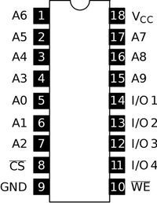
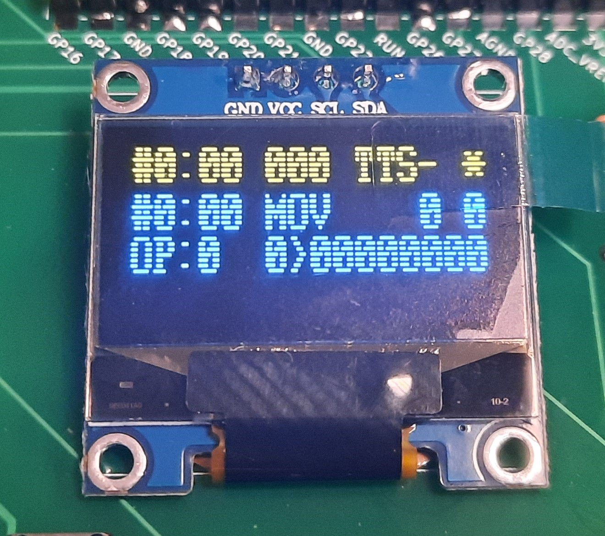

# PicoRAM 2090

A Raspberry Pi Pico (RP2040)-based 2114 SRAM Emulator, SD Card Interface,
and Multi-Expansion for the [Busch 2090 Microtronic Computer System from 1981](https://github.com/lambdamikel/Busch-2090).


## History of the Project  

PicoRAM 2090 started out as [a simple project to emulate the
Microtronic 2114 SRAM](README-old.md) in early September 2023, and
evolved into a powerful and versatile multi-expansion for the
Microtronic. It reached its current state end of November 2023.

As a contribution to the [RetroChallenge
2023/10](https://www.retrochallenge.org/p/entrants-list-202310.html) I
developed the firmware to maturity, still using the breadboard
prototype; see my [Hackaday IO
page](https://hackaday.io/project/192655-picoram-2090) and [YouTube
videos](https://www.youtube.com/playlist?list=PLvdXKcHrGqhd8HcGb5lirYrgMoVZjP5XO).

The project got covered by a number of sites: 

- [Hackaday: Pi Pico Becomes SRAM For 1981 Educational Computer](https://hackaday.com/2023/09/10/pi-pico-becomes-sram-for-1981-educational-computer/) 
- [Hackster: Michael Wessel Turns a Raspberry Pi Pico Into an Add-On for the Four-Bit Busch 2090 Microtronic SBC](https://www.hackster.io/news/michael-wessel-turns-a-raspberry-pi-pico-into-an-add-on-for-the-four-bit-busch-2090-microtronic-sbc-c21abaff56bd) 
- [PiShop Blog: Pi Pico Becomes SRAM for 1981 Educational Computer](https://blog.pishop.co.za/pi-pico-becomes-sram-for-1981-educational-computer/)


## About

**PicoRAM 2090 is the ultimate expansion for the Microtronic.**

It offers:

- SD card interface: loading and saving of programs (full SRAM memory dumps) and easy file exchange with the PC (FAT32 filesystem).
- Comfortable UI: 5 buttons and OLED display. 
- 16 memory banks: the currently active memory bank can selected manually via the UI or by program; each bank hosts a full Microtronic RAM.
- Mnemonics display: PicoRAM can show the current Microtronic instruction,
  address, and even mnemonics on its OLED display. Various display modes
  are offered - the mnemonics display greatly facilitates programming, 
  debugging, and learning the Microtronic machine language. 
- Harware extensions: speech synthesis (DECtalk-based), battery backed-up Real Time Clock (DS3231 RTC), monophonic sound, ASCII text and even graphics output on the OLED display. Extended "vacuous" op-codes (see below) are used to access the extensions.
- Full integration: for example, the Microtronic's `GET TIME` op-code (`F06`) is intercepted so that the actual time from the RTC is loaded instead of the Microtronic's (volatile, not battery backed-up) clock. 
- Easy build & installation: requires only simple modifications to the Microtronic PCB, and PicoRAM PCB uses off-the-shelf modules and through-hole components only. 

## Demo Videos

[YouTube Breadboard Prototype Demo](https://youtu.be/U6LDjYz8LTk) 

[YouTube Final PCB Demo](https://youtu.be/U6LDjYz8LTk)  


## Theory of Operation

### 2114 SRAM Emulation 

PicoRAM 2090 plugs into the 2114 SRAM socket of the Microtronic. The
2114 has a capactiy of 1024 4bit words, i.e., it has a 10 bit address
bus and a 4 bit data bus. The tristate (HighZ) capability of the 2114
is not utilized by the the Microtronic, so CS is not
connected.



Interestingly, the "CPU" of the Microtronic, the TMS1600
Microcontroller, does not cater for external RAM or ROM
memory, so the 2114 is connected via GPIO to the TMS1600:


However, the WE (Write Enable) line is of course required to
distinguish read from write accesses to memory.

Microtronic's RAM is organized as 256 12bit words. Thus, three 2114
memory locations are required to store one Microtronic word. This also
leaves 256 memory locations unoccopied.

As can be seen in the schematics, the "address" bus to the 2114 is
just a general-purpose output port, and shared with the 6-digit
7-segment display and keyboard. For the purpose of serving the RAM,
the Pico just runs a tight loop and presents the content of its
"memory array" on the 4 data lines as quickly as possible. It is not
necessary to distinguish the addresses that correspond to "real SRAM"
accesses from accesses that are caused by driving the display or from
scanning the keyboard (the Microtronic 2114 SRAM is actually
outputting data for these as well, but the firmware just ignored them
whilst driving the display or keyboard - it of course knows whether it
addressed the SRAM, the display, or the keyboard). Hence, the Pico is doing
the same.

Ideally, the CS signal would have been used to uniquely signal that
the currently presented address is a true SRAM address meant to
address memory, but as seen from the schematics, this is not the case,
and also not necessary in this design. 

As for write requests, we have a clear indiciation when to update the
C array holding the memory contents in terms of the WE signal going
low.  When this happens, PicoRAM stores the 4bit value presented on
the data lines into its memory C array.  

### Banked Memory

Given that the Microtronic memory is just a big C array, it is
straight-forward to support banked memory simply by adding one more
index / dimension to this array: the bank number. Switching the
currently active bank does not require any copying, but merely
changing the value of the "active bank" variable.

PicoRAM offers 16 banks that can be selected via the UI (`OK` button),
or by programm (extended op-code `70x`), and a few temporary banks
that are used for extended op-codes (see below).

### Identifying the Current Instruction

Identifying the 12bit instruction words that is currently addressed
(executed, displayed, ...) by the Microtronic is not straight-forward.

Even though the Pico sees all activity on the 10bit "address bus" and
4bit "data bus" (bus in double quotes here because these "buses" are
really just TMS1600 GPIO lines, and the CS signal of the 2114 is not
utilized!) it is *not* straight-forward to distinguish true SRAM
accesses for fetching the current instruction from "involuntarily"
ones that happen as a side effect of driving the 7segment LED display
or keyboard scanning activities of the Microtronic firmware (OS). 

However, by monitoring the last four addresses on the address bus,
a necessary condition for identifying the current Microtronic 12bit
instruction word is the following: 

```
	  if (adr & (1 << 8)) {
	    if (adr3 & (1 << 9)) {
	      if ( (adr & adr3 ) == adr4) {                    
```

where `adr` is the current address on the address bus,
and  

```
      adr4 = adr3;   
      adr3 = adr2; 
      adr2 = adr1; 
      adr1 = adr; 
``` 

is an "address window" of the last four addresses.

If the Pico detects such a sequence of addresses on the address bus, 
then this is a necessary condition for the Microtronic to access the
12bit instruction at address `adr4`.

Note that the three 4bit 2114 SRAM words that make up the 12bit
Microtronic word are not at consecutive addresses in the 2114 SRAM,
but utilize a set bit 8 and 9.

Unfortunately, his mechanism does not work for the address `00`.
Moreover, there are still "false positives" that are caused by display
multiplexing! In principle, these are indistinguishable from real SRAM
accesses from our external perspective - only the Microtronic firmware
knows whether it is addressing the SRAM or multiplexing the display.

To eliminate these false positives, and thus turn this condition into
a *sufficient (and necessary) condition* for the current instruction,
one more input signal from the TMS1600 is required: as can be seen in
the schematics, the TMS1600 GPIO port `R12` is used to address / drive
the individual six digits of the 7segment display. IF at least ONE of
the six digits is being enbled by R12, then this signal can be used to
identify display accesses and hence remove these false positives.
PicoRAM hence requires the `R12 (DISP)` wire to robustly identify the
current instruction (executed or on the monitor display). Without the
extra `DISP` wire for robust operation; without it, it will still
serve as SRAM emulator and SD card storage device, but extended
op-codes and hardware extensions (sound, speech, text and graphics
display, RTC) cannot be used.

Moreover, the display CANNOT be turned off completely while the
Microtronic program is running - programs that use the `F02 (DISPOUT)`
op-code, and hence run without display output, cannot use extended
op-codes. Extended op-codes (and hence the hardware extensions) can
only be used when the Microtronic 7segment LED display is displaying
something. Moreover, there can be no extended op-code at address `00`.
These are not severe restrictions. 

### Extended Op-Codes

Vacuous, extended op-codes are used to access the hardware extensions.
A vacuous op-code is a Microtronic op-code that does something, but
basically boils down to a convoluted no-op. These op-codes are being
executed by the Microtronic and leave the register contents
unchanged; hence, no real Microtronic program is using them. PicoRAM
monitors the current instruction, detects these special op-codes,
and uses them to implement certain side effects.

A simple example is the op-code `502`, `ADDI 0 to register 2`, which
means "add zero to register 2".  This is semantically a no-op, a
"vacuous" op-code. The PicoRAM detects this op-code and implements a
special side effect semantics for it: *clear the OLED display.* 

Many extended op-codes require operands though. For example,
`50D` = `play note` initiates a sound output command. The Pico
then enters the "sound extension enabled" mode, and is now
awaiting additional vacuous op-codes that specify the note
number to be played, as well as the octave (in reverse order).

To specify these operands / arguments, the vacuous op-codes `0xx`,
mnemonic `MOV x->x`, are used: "copy content of register `x` (0 to F)
onto inself". Depending on the number of nibbles `x` required as
operands / arguments to the currently active instruction, one to 8
such nibbles `x` can be specified immediately, i.e., literally, in the
code. For example, the sequence `50D 011 022` plays note 2 from octave
1.

Specifying arguments directly via `0xx` op-codes is fast, but lacks
flexbility. Since the Microtronic is a Harvard architecture, it is not
possible to modify the program memory with a program. Registers
have to be used.

In order to specify the value of a register as an operand / argument
to an extended op-code, i.e., say we want to play note `x` in register
0, we need a special trick. The problem is that PicoRAM does not have
any access to the register memory! The registers are stored directly
on the TMS1600 chip, and *not* in the 2114 SRAM. *So how can PicoRAM
get to know the current value of a register?* Answer: by temporarily
"banking-in" a register interrogation program that display a certain
behavior characteristic for register x having content y. This behavior
is observed by the Pico, and used to infer its current content
indirectly. 

The full technical explanation is complicated. But, in a nutshell, the
following is happening. Suppose we want to supply the (maybe computed)
note number to the `play tone`, `50D` op-code from register 0. We use
the vacuous op-code `3Fx`, `ANDI F x` ("do a logical AND of the
immediate value F with the content of register x") to mean "supply the
content of register x as argument". 

When the Pico detects `3Fx`, it immediately switches to a temporary
memory bank, and then executes a JUMP to address 00 (`C00`). From
there it then executes a "register interrogation program" - this
program performs a binary search to determine the current register
value.  Again, not that the Microtronic simply write the value into
program memory.  It can, however, do a number of compares and
conditional branches to determine the value via binary search. The
Pico is able to observe the addresses that are reached whilst the
Microtronic is executing this binary search "register interrogation
program", and certain target addresses are reached for certain
register values. The Pico is hence able to infer the register value of
the interrogated register. After the register value has been inferred,
a jump-back to the instruction after the original `3FX` is
materialized in the temporary memory bank, and the original memory
bank restablished, so that normal program execution continues.

From the user program's point of view, this happens trasparently.
However, it is quite slow - to determine the current value of a
register takes almost half a second or so, as a few dozend operations
have to be executed (and the Microtronic is a very slow machine).

Note that immediate / code-supplied and register-supplied arguments
can be combined. For example, here is a program that uses
register 0 to supply the note number, but specifies the octave
directly (immediate) in the code (address, op-code, and explanation):

```
00 F10 # display register 0 on display 
01 50D # sound output op-code
02 011 # supply value 1 (= octave 1) immediately 
03 3F0 # use content of register 0 for note number 
04 510 # increment register 0 
05 C01 # jump to address 01 (50D, ...) 
``` 


### Dual Core Operations

The first core of the Pico is implementing the SRAM emulation, including bank-switching, identifying the current instruction, etc.

The second core is implementing the UI, extended op-codes, access to
the hardware extensions, etc.

The Pico is overclocked to 250 Mhz (not a problem at all). 

## List of Extended Op-Codes

This is the current list of extended op-codes; note that future
firmware versions might contain additional sets (different op-code
sets might be selecteable from the UI).

Note that `<CHAR>`, `<NOTE>` and `<OCTAVE>` are single bytes, in
little endian order and hence a sequence of two nibbles: `<LOW>,
<HIGH>`.  Moreover, all graphics coordinates `X,Y,X1,X2,Y1,Y2` are
bytes and require 2 nibbles each. In contrast, `TX, TY` require one
nibble only (text screen colum / row coordinates):


---------------------------------------------------------------------------------------------
| Op-Code | # Operand / Argument Nibbles | Explanation                                      |
|---------|------------------------------|--------------------------------------------------|
| `0xx`   | 0                            | Enter Literal Data Nibble `x`                    |
| `3Fx`   | 0                            | Enter Data Nibble from Register `x`              |
| `500`   | 0                            | Hexadecimal Data Entry Mode                      | 
| `501`   | 0                            | Decimal Data Entry Mode                          |  
| `502`   | 0                            | Clear OLED Display                               |
| `503`   | 0                            | Auto or manual OLED display updates              | 
| `504`   | 0                            | Refresh OLED Display                             | 
| `505`   | 1                            | Display Clear Line <LOW>                         | 
| `506`   | 2                            | Display Show ASCII Character <CHAR>              | 
| `507`   | 1                            | Display Set Cursor at Line <TY>                  |  
| `508`   | 2                            | Display Set Cursor at Pos <TX> <TY>              | 
| `509`   | 4                            | Display Plot <LOW><HIGH> (=X) <LOW'><HIGH'> (=Y) |
| `50A`   | 8                            | Display Line <X1>,<Y1> <X2>,<Y2>                 |
| `50B`   | 4                            | Display Line From - <X>,<Y>                      |
| `50C`   | 4                            | Display Line To <X>,<Y> -                        | 
| `50D`   | 2                            | Play Note <OCTAVE> <NOTE> (Sound Model Only)     | 
| `50E`   | 0                            | Enable TTS Display Echo                          | 
| `50F`   | 1                            | Send <CHAR> to TTS (Speech Mode Only)            | 
| `70x`   | 1                            | Select Memory Bank `x`                           | 
---------------------------------------------------------------------------------------------


## Operating Instructions

The following instructions should explain how 
to operate PicoRAM. 

### Power Supply 

Power to the PicoRAM is supplies either directly from the Microtronic
(`2090 VCC`), or from an optional, external stabilized standard 5V
power supply with positive tipp / center polarity (`EXT VCC`). The
LEDs `2090 VCC` and `EXT VCC` indicate which power sources are
available.


Note that the `EXT VCC` LED will not come on if you have
the wrong polarity! In this case, *do not power on the PicoRAM*!
External VCC is *not* fed into the Microtronic - only GND is shared.
Use the `SEL VCC` switch to determine the power source. Usually, the
Microtronic PSU is strong enough to drive PicoRAM, so an external
additional PSU is not really required, but you may choose to use one
to be on the safe side anyway.


Before powering on the Microtronic, make sure PicoRAM 2090 is running!
Turn on PicoRAM by pushing the POWER button.

The `PWR`LED on the MikroE speech daugher board should come on immediately,
as well as the OLED display. 

### Audio 

Use a standard mini stereo jack connector cable to connect the
MikroE TextToSpeech click board to the `LINE IN` connector.
Determine the VOLUME using the potentiometer.

PicoRAM is equipped with a [PAM8403 class D audio amplifier](https://www.ebay.com/itm/191855753895) powering a loudspeaker of your choice.


PicoRAM offers *either* TextToSpeech (TTS), using the MikroE click
board, or sound (generated by the Pico itself). Unfortunately, only
one at a time is possible due to a shortage of GPIO pins on the Pico.

Use the switch labeled `TTS or SOUND` to select either. A push to
the `RESET` button is required for the new mode to become effective.

The current audio mode is also indicated in the OLED display (using `TTS` or `SND` indicators): 





### Reset Button

The `RESET` button resets the Pico and hence all emulated memory
banks. Memory banks can be saved to SD card if required. 

### SD Card

Use a FAT32 formatted Micro SD Card. Note that `ERROR 2` will
occur if PicoRAM is started without SD Card, or if the SD card
is write protected, not properly formatted, or faulty.

### OLED Status Display & Display Modes 

The PicoRAM OLED display looks as follows:


The first line shows

- the current memory bank number the PicoRAM is serving: `#0`. 
- the current address of the Microtronic: `00`.
- the current 12bit instruction word / op-code: `000`. 
- the current audio mode: `SND`, `TTS-`, or `TTSE`. `SND` means sound output, else `TTS` is active. See the `TTS or SOUND` switch.
  `TTSE` means "TTS Echo", i.e., everything printed to the OLED display is automatically sent to the TTS (and uttered when an end-of-line character, CR or LF, is sent). 
- whether extended op-codes are enabled (`*`) or disabled (`-`). 

The second line shows the current bank, address and instruction, but using mnemonics.

The third line is shown when extended op-codes are enabled, and mostly usefull for single stepping and
debugging. It shows the status and kind of currently executed / prepared extended op-code (i.e., op-code
type and its arguments): 


The fourth line is used for file operations, or for displaying the Real Time Clock current time etc.

**Note that the display has various modes, and when the Microtronic is actually running a program, it
should usually be turned off!** The display mode can be changed using the `CANCEL` button.

It is important that the **display is switched off when a program with extended op-codes is running** -
not only might the Microtronic program want to utilize the display for text or graphics output, but
also from a performance point of view it can be critical to switch off the display so that the 2nd
core does have all cycles available to implement the extended op-codes rather than spent time updating
the display.

Using the `CANCEL` button, the modes of the display are:

- display off: this should be the default when the Microtronic is runnign a program with extended op-codes; updating the display requires cycles from the 2nd core which might then run at risk of running out of sync with the Microtronic. 
- op-code display: first line only. 
- op-code & mnemonics display: first and second line; the third line showing the extended op-codes status is displayed when extended op-codes are enabled. This should be the default for programm development and single stepping through and debugging of the Microtronic program.  

### User Interface Buttons 


The button legend list the button label and its **primary and secondary function.** The **primary function** corresponds to a short press of the button, and the **secondary function** is selected by a longer press of the button (i.e., about half a second).

The **button labels** are **indicative of the functions that these buttons play during file creation and file selection**: 
- in file load mode (`UP` button) the `UP` and `DOWN` buttons are used to select a file from the list of files on the SD card. `OK` is used to confirm loading of the current file,  whereas `CANCEL` is used to abort the load process. 
- in file save mode (`DOWN` button) the `UP` and `DOWN` buttons are used to select the next character of the filename under constructions. A short press of `NEXT/PREV` advances to the next character, and a longer press jumps back to the previous character. `OK` and `CANCEL` are self-explanatory. The buttons have analog functions for setting the real time clock (see secondary function of `CANCEL`). 

In a nutshell, the **primary functions of the buttons** are (if executed from the main loop / context of PicoRAM):

- `UP`: Load a memory dump from SD card, using the file selector. 
- `DOWN`: Save a memory dump to SD card, using the file name creator.
- `NEXT/PREV`: Increment the current active memory bank number by 1; 16 banks are available. These banks are pre-loaded with some program, see below for the list. The currently active memory bank can simply be erased using Microtronic's standard clear memory procedure: `HALT-PGM-5` (or `HALT-PGM-6` for `NOP` op-codes). Note that this only affects the currently active bank! But all banks are reset to default contents upon reset of the PicoRAM (`RESET` button or power cycle). 
- `OK`: En-/disable extended op-codes. When extended op-codes are enabled, PicoRAM acts as a "co-processor" and the already discussed vacuous op-codes are utilized to drive the hardware extension, i.e., for sound, speech, text or graphics output, and bank switching. A `*` in the display status line (first line) indicates if op-code extensions are active or not. When active, and a program is run, the OLED display should always be in off mode.
- `CANCEL`: toggle OLED display mode (off, op-code display, op-code & mnemonics display).

The **secondary functions of the buttons** are (if execute from the main loop / context of PicoRAM): 

- `UP`/`DOWN`: Test the audio output (either sound or speech, depending on the mode). 
- `DOWN`: List all the `.MIC` files on SD card.
- `NEXT/PREV`: If in TTS mode, speak the current time of the RTC.
- `OK`: Show the current time of the RTC on the OLED display.
- `CANCEL`: Set the current time of the RTC using the OLED display.

## Pre-Loaded Memory Banks / Programs

The default / power-on memory bank programs are as follows. A `*`
behind the bank number indicates that op-code extensions must be
enabled for this program to work properly.

All programs are started via `HALT-NEXT-0-0-RUN`: 

-------------------------------------------------------------------------------
| Bank # | Extended Op-Codes? | Description                                   |
| ------ | ------------------ | --------------------------------------------- |
| 0      | *                  | Demonstrates `F06 (GET TIME)` op-code via RTC | 
| 1      |                    | 17+4 Blackjack                                |
| 2      |                    | Nim Game                                      |
| 3      |                    | Three Digit Counter                           | 
| 4      |                    | Electronic Die (Random Generator from 1 to 6) |
| 5      |                    | Three Digit Counter                           | 
| 6      |                    | Scrolling LED Light ("Lauflicht")             | 
| 7      |                    | Digital Input Port Test (DIN Op-Code)         | 
| 8      |                    | Lunar Lander Game                             | 
| 9      |                    | Prime Numbers                                 |
| A      |                    | Tic Tac Toe                                   | 
| B      |                    | Car Racing                                    |
| C      |                    | Blockade                                      | 
| D      | *                  | Regload Test Program                          | 
| E      |                    | Empty                                         | 
| F      |                    | Empty                                         |
-------------------------------------------------------------------------------

These programs may change without notice. 

## Using PicoRAM with the Microtronic

The standard operation sequence should look as follows:

- load a memory dump from SD card using the `UP` button; select a `.MIC` file using `UP`, `DOWN`, and `OK` / `CANCEL`. 
- set the Microtronic to address 00: `HALT-NEXT-00`.
- disable the OLED display using the `CANCEL` button.
- ensure that extended op-codes are enabled: hit the `OK` button until `OP-EXT ON (*)` is shown.
- start the Microtronic program: `HALT-NEXT-00-RUN`.
- important: **when the Microtronic program has finished, DISABLE extended op-codes!**

The last step is imporant because some of the extended op-codes may require banking-in of temporary,
auxiliary program fragments. If the program is interrupted whilst interrupting one of these
banked-in "helper" programs, then the Microtronic will appear to have a lost its original
memory content. When this happens, and you don't find your program in memory, simply disable
extended op-codes until (hit `OK` until `OP-EXT OFF (-)` is shown), and set the Microtronic monitor
to a well-defined address: `HALT-NEXT-00`. Your program will immediately appear again, as the original
user program bank has been restored.

Note that your program will also "disappear" if you hit the `NEXT/PREV`
buttons accidentially, i.e., the current memory bank has
changed. Simply re-select your program's original memory bank by
toggling through the 16 banks until the original bank is restored. 

## Example Programs

Example programs are [here.](software/) 

## Schematics, Gerbers, and Firmware 


Here you will find [the firmware](firmware/sram.uf2),
the [PDF schematics](schematics/picoram-schematics.pdf),
and the [Gerbers](gerbers/gerbers.zip).

Firmware sources soon. 

## Assembly Notes

The Microtronic's 2114 SRAM socket must be replaced by a standard (ideally, machined) DIP socket:


Moreover, the `R12 (DISP)` line requires a pin-connector - there is a via 
on the Microtronic PCB which can be used for this: 


The modified Microtronic PCB should look as follows then: 


 
PicoRAM is easy to assemble; everything is through-hole, and off-the-shelf modules are used.

I recommend to use a machined DIP socket for the ribbon wire cable connector: 


## Bill of Material

----------------------------------------------------------------------------------------------------------------------
| Reference     | Description                                                                                        |
| --------------| ---------------------------------------------------------------------------------------------------| 
| C1            | 100 uF Polarized                                                                                   |
| C2            | 100 nF                                                                                             |  
| R1, R7, R8    | 2k Ohm                                                                                             |
| R2            | 330 Ohm                                                                                            |
| R3            | 620 Ohm                                                                                            |  
| R4            | 1k Ohm                                                                                             |
| R5            | 3.3k Ohm                                                                                           |
| R6            | 120 Ohm                                                                                            |
| RN1, RN2      | 20k Ohm Isolated Resistor Network (DIP-16 W=7.62 mm)                                               |
| RN5           | 1k Ohm Isolated Resistor Network (DIP-16 W=7.62 mm)                                                |
| RN6           | 2k Ohm Isolated Resistor Network (DIP-16 W=7.62 mm)                                                |
| RV1           | 101 (100 Ohm) Potentiomer / Trimmer                                                                |
| SW1, SW2, SW6 | [DPDT 8.5 mm Switch (GRAY, NOT BLUE!!)](https://www.amazon.com/dp/B081VB7LY2)                      |
| D1, D2        | 3.0 mm LEDs                                                                                        |
| J5            |[Stereo Socket](https://www.amazon.com/gp/product/B077D1NY4T)                                       |
| LS1           | Loudspeaker                                                                                        |
| J1, J2        | [PAM8403 Class D audio amplifier](https://www.ebay.com/itm/191855753895)                           |
| Brd1          | [SSD1306 128x64 OLED Display](https://www.amazon.com/gp/product/B09C5K91H7/)                       |
| U1            | [RTC DS3231](https://www.amazon.com/gp/product/B00LX3V7F0)                                         |
| U2            | [Raspberry Pi Pico](https://www.amazon.com/Raspberry-Pi-Pico-RP2040-microcontroller/dp/B09437S9X4) |
| U3            | [MIKROE-2253 TextToSpeech Click!](https://www.mikroe.com/text-to-speech-click)                     |
| U4            | [AdaFruit MICROSD Module](https://www.adafruit.com/product/4682)                                   |
| U5            | Machined Socket (DIP-18, W=7.62mm)                                                                 |
----------------------------------------------------------------------------------------------------------------------

For SW, SW2, SW6, note that the common pin of these switches needs to
be in the middle! The Blue and Gray switches from Amazon are
different - get the Gray ones!

Moreover, I am using [Mounting
Feet](https://www.amazon.com/gp/product/B07DHHS1Q8) and crimpable
18-pin DIP rectangule cable assembly connectors (hard to find!).
But ordinary DuPont cables will also do. 

## Ackknowledgements

- Harry Fairhead for his [execellent book](https://www.amazon.com/gp/product/1871962056)
- Hans Hübner (aka Pengo) for motivating me to abandon the BluePill, ATmegas and Arduinos,
and for helping to get started and troubleshooting! 
- The authors of the libraries I am using:
  - Carl J Kugler III carlk3: [https://github.com/carlk3/no-OS-FatFS-SD-SPI-RPi-Pico](https://github.com/carlk3/no-OS-FatFS-SD-SPI-RPi-Pico)
  - Raspberry Pi Foundation for the `ssd1306_i2c.c` demo.


## Dedication

Dedicated to my late father, Rudolf Wessel (26.12.1929 - 15.10.2023).

R.I.P, Papa - I will always fondly remember the days following
Christmas 1983 for which you and Mom got me the Microtronic, and we
entered the dauntingly big "Lunar Lander" program together. In loving memory! 