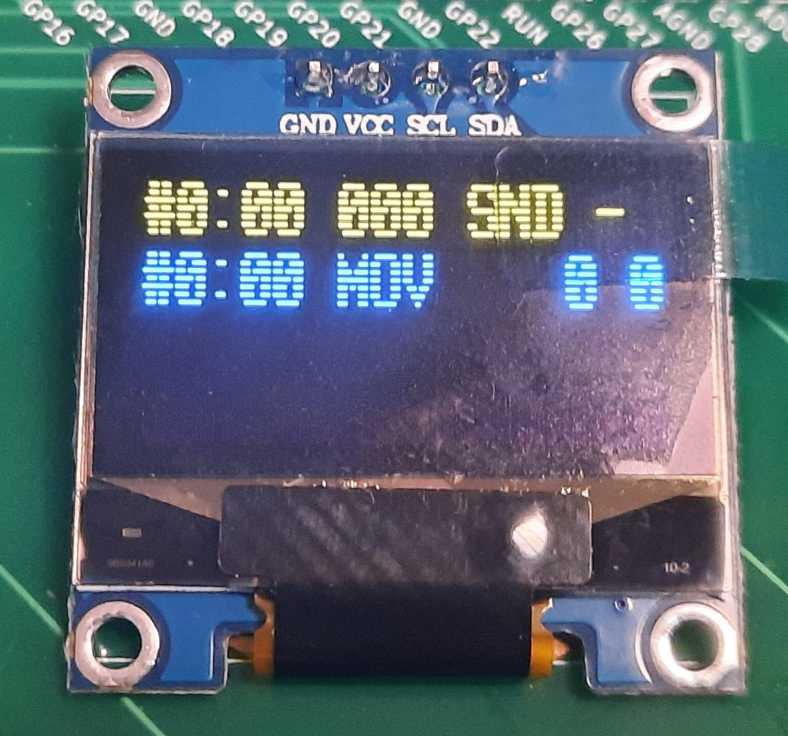

# PicoRAM 2090

A Raspberry Pi Pico (RP2040)-based 2114 SRAM Emulator, SD Card
Interface, and Multi-Expansion for the [Busch 2090 Microtronic
Computer System from 1981](https://github.com/lambdamikel/Busch-2090).


## History of the Project  

PicoRAM 2090 started out as [a simple project to emulate the
Microtronic 2114 SRAM](README-old.md) in early September 2023, and
evolved into a powerful and versatile multi-expansion for the
Microtronic. It reached its current state end of November 2023.

As a contribution to the [RetroChallenge
2023/10](https://www.retrochallenge.org/p/entrants-list-202310.html) I
developed the firmware to maturity, still using the breadboard
prototype; see my [Hackaday IO
page](https://hackaday.io/project/192655-picoram-2090) and [YouTube
videos](https://www.youtube.com/playlist?list=PLvdXKcHrGqhd8HcGb5lirYrgMoVZjP5XO).

The project got covered by a number of sites: 

- [Hackaday: Pi Pico Becomes SRAM For 1981 Educational
  Computer](https://hackaday.com/2023/09/10/pi-pico-becomes-sram-for-1981-educational-computer/)
  

- [Hackster: Michael Wessel Turns a Raspberry Pi Pico Into an Add-On
  for the Four-Bit Busch 2090 Microtronic
  SBC](https://www.hackster.io/news/michael-wessel-turns-a-raspberry-pi-pico-into-an-add-on-for-the-four-bit-busch-2090-microtronic-sbc-c21abaff56bd)
  

- [PiShop Blog: Pi Pico Becomes SRAM for 1981 Educational
  Computer](https://blog.pishop.co.za/pi-pico-becomes-sram-for-1981-educational-computer/)


## About

**PicoRAM 2090 is the ultimate expansion for the Microtronic.**

It offers:

- SD card interface: loading and saving of programs (full SRAM memory
  dumps) and easy file exchange with the PC (FAT32 filesystem).

- Comfortable UI: 5 buttons and OLED display.

- 16 user memory banks: the currently active memory bank can selected
  manually via the UI or by program; each bank hosts a full
  Microtronic RAM.

- Mnemonics display: PicoRAM can show the current Microtronic
  instruction, address, and even mnemonics on its OLED
  display. Various display modes are offered - the mnemonics display
  greatly facilitates programming, debugging, and learning the
  Microtronic machine language.

- Harware extensions: speech synthesis (DECtalk-based), battery
  backed-up Real Time Clock (DS3231 RTC), monophonic sound, ASCII text
  and even graphics output on the OLED display. Extended "vacuous"
  op-codes (see below) are used to access the extensions.

- Full integration: for example, the Microtronic's `GET TIME` op-code
  (`F06`) is intercepted so that the actual time from the RTC is
  loaded instead of the Microtronic's (volatile, not battery
  backed-up) clock.

- Easy build & installation: requires only simple modifications to the
  Microtronic PCB, and PicoRAM PCB uses off-the-shelf modules and
  through-hole components only.

## Demo Videos

[YouTube Breadboard Prototype Demo](https://youtu.be/U6LDjYz8LTk) 

[YouTube Final PCB Demo](https://youtu.be/U6LDjYz8LTk)  


## Theory of Operation

### 2114 SRAM Emulation 

PicoRAM 2090 plugs into the 2114 SRAM socket of the Microtronic. The
2114 has a capactiy of 1024 4bit words, i.e., it has a 10bit address
bus and a 4bit data bus. The tristate (HighZ) capability of the 2114
is not utilized by the the Microtronic, so CS is not connected. 


Interestingly, the "CPU" of the Microtronic, the mask-programmed
TMS1600 Microcontroller, does not cater for external RAM or ROM, so
the 2114 is connected via GPIO to the TMS1600. This can be seen
clearly in the Microtronic schematics: 


The WE (Write Enable) line is of utilized to distinguish read from
write accesses to the 2114. 

Microtronic's RAM is organized in 256 12bit words. Thus, three 2114
memory locations are required to store one Microtronic 12bit
word. Interestingly, this also leaves 256 memory locations in the 2114
unused.  To the best of our knowledge, these SRAM locations are just
void.

As can be seen in the schematics, the "address" bus to the 2114 is
utilizing general-purpose TMS1600 output ports (6 bits from the `R`
port and `4` bits from the `O` port), which are also shared with the
6-digit 7-segment LED display and keyboard! Since CS is not utilized
by this design, it is challenging to distinguish Microtronic's SRAM
accesses on these ports from keyboard scanning and display driving
activitiy (see below). 

For the purpose of serving the RAM, the Pico just runs a tight loop
and presents the content of its "memory array" on the 4 data lines as
quickly as possible.

Luckily, for the mere purpose of SRAM emulation, is not necessary to
distinguish the addresses that correspond to "real SRAM" accesses from
accesses caused by driving the display and keyboard scanning - the
2114 SRAM is actually presenting data for these as well, but the
Microtronic firmware just ignores them whilst driving the display or
keyboard (it of course knows whether it addressed the SRAM, the
display, or the keyboard). This situation isn't different with the
Pico RAM emulating the 2114. It, too, reacts to all presented
addresses and presents data for all of them on the data port; some of
them will be meaningless and ignores by the Microtronic firmware.
Ideally, the CS signal would have been used to unambiguously identify
the "real" SRAM accesses, but as explained, this is not an option in
the Microtronic design.

As for write requests, the situation is much simpler - we have a clear
signal in form of the WE signal gowing low when to update the C array
holding the memory contents. When this happens, PicoRAM simply stores
the current 4bit value on the data lines (`L1`, `L2`, `L4`, `L8`) 
into its memory C array.

### Banked Memory

Given that the Microtronic memory is just a big C array, it is
straight-forward to support banked memory simply by adding one more
index / dimension to this array: the bank number. Switching the
currently active bank does not require any copying, but merely
changing the value of the "active bank" index variable:

```
  val = ram[cur_bank][adr];
  gpio_put_masked(data_mask, ~ (val << DATA_GPIO_START));
```

PicoRAM offers 16 user RAM banks that can be selected via the UI (`OK`
button), or by programm (extended op-code `70x`). Moreover, a few
temporary banks are used for implementing and managing the extended
op-codes (see below).

### The Challenge of Identifying the Current Instruction

Identifying the 12bit instruction words that is currently addressed
(executed, displayed, ...) by the Microtronic is not straight-forward
due to the missing 2114 CS signal. 

Even though the Pico sees all activity on the 10bit "address bus" and
4bit "data bus" (bus in double quotes here because these "buses" are
really just TMS1600 GPIO lines, as explained) it is *not*
straight-forward to distinguish true SRAM accesses for fetching the
current 12bit instruction word from "involuntarily" accesses that
happen as a side effect of driving the LED display or keyboard
scanning performed by the Microtronic firmware ("OS"). 

However, by monitoring the last four addresses on the address bus, *a
necessary condition* for identifying the current Microtronic 12bit
instruction word is the following:

```
	  if (adr & (1 << 8)) {
	    if (adr3 & (1 << 9)) {
	      if ( (adr & adr3 ) == adr4) {                    
```

where `adr` is the current address on the address bus, and ``adr4`` to
``adr`` are the last four addresses that have been seen on the
address bus. 

If the Pico detects such a sequence of addresses on the address bus,
then the Microtronic has fetched a 12bit instruction starting at
Microtronic memory address `adr4 & 0xFF`. Note that three 4bit 2114
SRAM words that make up a 12bit Microtronic op-code / instruction word
are these are not at consecutive memory locations in the
2114. Instead, set bits 8 and 9 are used to group the three 4bit words
into one 12bit word.

Unfortunately, his mechanism does not work for Microtronic word at
Microtronic address `00`.  Moreover, there are still **false
positives** that are caused by display multiplexing! In principle,
these false positives are indistinguishable from real SRAM accesses
from PicoRAM's external perspective - only the Microtronic firmware
knows whether it is addressing the SRAM or the keyboard or display. 

To *eliminate these false positives*, and also turn this necessary
condition into a **sufficient condition**, it has to be strengthened
by adding one more input signal from the TMS1600 to the mix - the
`R12` line. As can be seen in the schematics, the TMS1600 GPIO port
`R12` is used to trigger / drive the individual digits of the
display. We can hence eliminate all addresses that also have `R12` 
active, provided that the display is on, i.e., at least one of the
six 7segment digits is shown on the Microtronic's LED display.

**PicoRAM hence requires the `R12 (DISP)` signal to robustly identify
the current instruction that is executed, or on the LED display, by
the Microtronic.** Without the extra `DISP` wire for robust operation
it will still perfectly function as SRAM emulator and SD card storage
device, but extended op-codes and hardware extensions (sound, speech,
text and graphics display, RTC) will not function properly, and the
op-code OLED display will also not work properly. Hence, I strongly
recommend to add the extra `DISP` wire to the Microtronic PCB; it's a
simple mod.

*It should be clear by now that extended op-codes will not work
reliably for programs that turn off the LED display using the `FO2
(DISP OUT)` op-code. Moreover, there can be no extended op-code at
address `00`.  These are not severe restrictions.* 

### Extended Op-Codes

**Vacuous, extended op-codes** are used to access the hardware
extensions.  A *vacuous op-code* is a Microtronic op-code that does
something, but basically boils down to a convoluted no-op. These
op-codes are being executed by the Microtronic and leave the register
contents unchanged; hence, no real Microtronic program is using them
(they would rather use `F01 (NOP)` instead). PicoRAM monitors the
current instruction, detects these special vacuous op-codes, and put
them to work by implementing extra side effects, i.e., to drive the
PicoRAM hardware extensions.

A simple example is the op-code `502`, `ADDI 0 to register 2`, which
means "add zero to register 2".  This is semantically a no-op, a
"vacuous" op-code. No existing Microtronic program uses it. It is
hence available to be used for PicoRAM! PicoRAM detects this 
op-code and implements a special side-effect semantics for it: **clear
the OLED display.** 

Many *extended op-codes require operands / arguments though.* For
example, the PicoRAM's extended op-code `50D (Play Note)` initiates a
sound output command. This command requires arguments - the octave,
and note number to be played. The Pico then enters the "sound
extension enabled" mode, and is now awaiting additional vacuous
op-codes that specify these arguments. 

To specify these operands / arguments literrally in the machine code
("immediate" style), the vacuous op-codes `0xx`, mnemonic `MOV x->x`,
are used: "copy content of register `x` (0 to F) onto
inself". Depending on the number of nibbles `x` required as operands /
arguments, 1 to 8 such nibbles `x` are supplied. For example, the
op-code sequence `50D 011 022` plays note 2 from octave 1. 

Specifying arguments directly (literally, immediately in code) via
`0xx` op-codes is fast, but lacks flexbility - arguments can then not
be computed at runtime! Since the Microtronic is a Harvard
architecture, it is not possible to modify the program memory with a
program. Registers have to be used instead if runtime computed
arguments are required. 

In order to use the value of a *register as an operand / argument to
an extended op-code**, e.g., say to *play note number `x` in register
0*, we need a special trick. The problem is that PicoRAM does not have
access to the register memory, as Microtronic registers are stored on
the TMS1600 chip, not in the 2114 SRAM. *So how can PicoRAM get to
know the current value of a register?* Answer: *by temporarily
"banking-in" a register interrogation program* that shows certain
address access-pattern characteristic for register `x` having value
`y`. The Microtronic's execution of this interrogation program is
observed by the the Pico, from which it can then infer the current
value `y` of register `x` indirectly (a certain address is reached by
the program that gives it away).

Here is an example. Suppose we want to supply the (maybe computed)
note number to the `50D (Play Note)` extended op-code from register
0. Instead of using `0xx` to supply the nibble immediate and literally
as a constant in the code, we are now using the vacuous op-code `3Fx`,
`ANDI F x` ("do a logical AND of the immediate value F with the
content of register x") to mean *supply the content of register x as
argument to the current extended instruction*. 

When the Pico detects `3Fx`, it now immediately switches to a
*temporary memory bank containing the interrogation program*, i.e.,
materializes this program for the Microtronic, and then presents a
JUMP to address `00` (`C00`) to the Microtronic as the next
instruction word. Hence, the Microtronic has now left user program
execution, and starts executing the interrogation program starting at
address 00 in the temporary memory bank. This interrogation program
performs a binary search to determine the current register value.  The
Microtronic cannot simply write the current value of the register into
program memory for the Pico to see, due to its Harvard architecture.
It can, however, do a number of compares and conditional branches to
determine the register value via binary search! The Pico observes the
addresses that are reached during the execution of the banked-in
interrogation program, and **characteristic, unique target addresses
are reached for specific register values**. One such a target address
has been reached by the Microtronic executing the interrogation
program, the Pico knows the value of the interrogated register. It
uses this value to supply the next argument to the current extended
op-code waiting for it. When all arguments have been "collected", the
extended op-code is executed by PicoRAM. Finally, now that the
register value has been inferred, a JUMP instruction after the
original `3Fx` is temporarily materialized for the Microtronic by the
Pico, and the original user memory bank restored. The Microtronic
continues execution of the user program with the next instruction
after `3Fx` as if nothing had happened.

From the user program's point of view, this register interrogation
process happened trasparently. However, it is quite slow - determining
the current value of a register takes almost quarter of a second or
so, as a few dozend operations have to be executed from the
interrogation program (the Microtronic is a very slow machine indeed,
clocked the TMS1600 is clocked at 500 kHz, and it should have become
clear now that the Microtronic OS / firmware is a very complex
program).

Note that immediate / code-supplied and register-supplied arguments
can be mixed. For example, here is a program that uses register 0 to
supply the note number to be player, but specifies the octave number
in code:

```
00 F10 # display register 0 on display 
01 50D # sound output op-code
02 011 # supply value 1 (= octave 1) immediately 
03 3F0 # use content of register 0 for note number 
04 510 # increment register 0 
05 C01 # jump to address 01 (50D, ...) 
``` 

### Dual Core Operations

PicoRAM utilizes both cores of the RP2040 (Raspberry Pi Pico). 

The *first core* of the Pico is implementing the SRAM emulation,
including bank-switching, identifying the current address and
instruction, etc.

The *second core* is driving the OLED display, and implements the UI,
extended op-codes, and access to the hardware extensions.

The Pico is *overclocked to 250 Mhz* - this is still well within range
and not problematic at all (some folks have successfully overclocked
the Pico to 1 GHz!)

## List of Extended Op-Codes

This is the current list of extended op-codes; note that future
firmware versions might contain additional sets (and different 
sets might be selecteable from the UI).

In the following, `<CHAR>`, `<NOTE>` and `<OCTAVE>` represent single
bytes, in little endian order (a sequence of two nibbles: `<LOW>,
<HIGH>`).  Moreover, all graphics coordinates `X,Y,X1,X2,Y1,Y2` are
bytes and require 2 nibbles each. In contrast, `TX, TY` are text
display cursor location (text screen colum / row coordinates), and
only reguire a single nibble (`<LOW>`), or two nibbles (`<LOW>,
`<LOW'>`):

---------------------------------------------------------------------------------------------
| Op-Code | # Operand / Argument Nibbles | Explanation                                      |
|---------|------------------------------|--------------------------------------------------|
| `0xx`   | 0                            | Enter Literal Data Nibble `x`                    |
| `3Fx`   | 0                            | Enter Data Nibble from Register `x`              |
| `500`   | 0                            | Hexadecimal Data Entry Mode                      | 
| `501`   | 0                            | Decimal Data Entry Mode                          |  
| `502`   | 0                            | Clear OLED Display                               |
| `503`   | 0                            | Auto or manual OLED display updates              | 
| `504`   | 0                            | Refresh OLED Display                             | 
| `505`   | 1                            | Display Clear Line <LOW>                         | 
| `506`   | 2                            | Display Show ASCII Character <CHAR>              | 
| `507`   | 1                            | Display Set Cursor at Line <TY>                  |  
| `508`   | 2                            | Display Set Cursor at Pos <TX> <TY>              | 
| `509`   | 4                            | Display Plot <LOW><HIGH> (=X) <LOW'><HIGH'> (=Y) |
| `50A`   | 8                            | Display Line <X1>,<Y1> <X2>,<Y2>                 |
| `50B`   | 4                            | Display Line From - <X>,<Y>                      |
| `50C`   | 4                            | Display Line To <X>,<Y> -                        | 
| `50D`   | 2                            | Play Note <OCTAVE> <NOTE> (Sound Model Only)     | 
| `50E`   | 0                            | Enable TTS Display Echo                          | 
| `50F`   | 1                            | Send <CHAR> to TTS (Speech Mode Only)            | 
| `70x`   | 1                            | Select Memory Bank `x`                           | 
---------------------------------------------------------------------------------------------

Please have a look at the provided [example programs](software/).

Here is an [example program demonstrating graphics, text, and speech output](software/MICRONET.MIC) - ensure TTS is enabled: 


```
F08
F20
50A
000
3F0
088
000
000
3F1
0FF
011
520
980
E0F
C02
100
521
981
E14
C02
50E
506
0DD
044
099
044
033
044
022
055
0FF
044
044
055
022
055
0FF
044
0EE
044
099
044
033
044
0AA
000
F00
```


## Operating Instructions

The following instructions should explain how 
to operate PicoRAM. 

### Power Supply 

Power to the PicoRAM is supplies either directly from the Microtronic
(`2090 VCC`), or from an optional, external stabilized standard 5V
power supply with positive tipp / center polarity (`EXT VCC`). The
LEDs `2090 VCC` and `EXT VCC` indicate which power sources are
available.


Note that the `EXT VCC` LED will not come on if you have the wrong
polarity! In this case, *do not power on the PicoRAM*!  External VCC
is *not* fed into the Microtronic - only GND is shared.  Use the `SEL
VCC` switch to determine the power source. Usually, the Microtronic
PSU is strong enough to drive PicoRAM, so an external additional PSU
is not really required, but you may choose to use one to be on the
safe side anyway. Before powering on the Microtronic, make sure
PicoRAM 2090 is running!  Turn on PicoRAM by pushing the `POWER`
button. The `PWR`LED on the MikroE speech daughter board should come
on immediately, as well as the OLED display.


### Audio 

Use a standard mini stereo jack connector cable to connect the MikroE
TextToSpeech click board output to the `LINE IN` mini stereo jack.
Determine the `VOLUME` using the potentiometer.

PicoRAM is equipped with a [PAM8403 class D audio
amplifier](https://www.ebay.com/itm/191855753895) powering a little (4
or 8 bit Ohm) loudspeaker of your choice.


PicoRAM offers *either* TextToSpeech (TTS), using the MikroE click
board for DECtalk, or sound (generated by the Pico
itself). Unfortunately, only one at a time is possible due to a
shortage of GPIO pins on the Pico.

Use the switch labeled `TTS or SOUND` to select either. A push to the
`RESET` button is required for the new mode to become effective.

The current audio mode is also indicated in the OLED display (`TTS`-`,
`TTSE` or `SND` indicators in the first display line). 

### Reset Button

The `RESET` button resets the Pico and hence all emulated memory
banks. Memory banks can be saved to SD card if required.

### SD Card

Use a FAT32 formatted micro SD card. Note that `ERROR 2` will occur if
PicoRAM is started without SD card, or if the SD card is write
protected, not properly formatted, or faulty.

### OLED Status Display & Display Modes 

The PicoRAM OLED display looks as follows:



The **first line** shows

- the number of the current memory bank the PicoRAM is serving: `#0`.

- the current Microtronic address: `00`.

- the current Microtronic 12bit instruction word / op-code: `000`. 

- the current audio mode: `SND`, `TTS-`, or `TTSE`. `SND` means sound
  output, else `TTS` is active. See the `TTS or SOUND` switch.  `TTSE`
  means "TTS Echo", i.e., everything printed to the OLED display is 
  automatically sent to the TTS (and uttered when an end-of-line
  character, CR or LF, is sent). TTS Echo is enabled with the
  op-code `50E`. 

- whether extended op-codes are enabled (`*`) or disabled (`-`). 

The **second line** shows the current bank, address and instruction 
using Microtronic mnemonics.

The **third line** is shown when extended op-codes are enabled, and
mostly useful for program single stepping and debugging. It shows the
status and kind of currently executed / prepared extended op-code
(i.e., op-code type and its arguments):


The **fourth line** is used for file operations, for displaying the
current time of Real Time Clock, etc.

It is important that the **display is switched off when a program with
extended op-codes is running** - not only might the Microtronic
program want to utilize the display for text or graphics output, but
also from a performance point of view it can be critical to switch off
the display so that the 2nd core does have all cycles available to
implement the extended op-codes rather than having to spent time
updating the OLED display.

Using the `CANCEL` button, the modes of the display are:

- **display off:** this should be the default when the Microtronic is
  running a program with extended op-codes, as updating the display
  requires cycles from the 2nd core which might then glitch on the
  extended op-codes as just explained.

- **op-code display:** first line only.

- **op-code & mnemonics display:** first and second line; the third line
  showing the extended op-codes status is displayed when extended
  op-codes are enabled. This should be the default for programm
  development, single stepping and debugging of  
  Microtronic programs.

### User Interface Buttons 


The **button legend** lists the button label (first column) on the PCB silkscreen as well 
as its **primary and secondary function** (second and third column, resp.) 

The **primary function** is selected with a short press to the button,
and the **secondary function** with a longer press (i.e., hold the
button down for about half a second before releasing it).

The **button labels** are **indicative of their functions during file creation and file selection**: 

- **in file load mode** (`UP` button) the `UP` and `DOWN` buttons are used
  to *select a file from the list of files* on the SD card. `OK` is used
  to confirm loading of the current file, whereas `CANCEL` is used to
  abort the load process.

- in **file save mode** (`DOWN` button) the `UP` and `DOWN` buttons are
  used to *determine the next ASCII character of the filename under
  constructions.* A short press of `NEXT/PREV` advances to the next
  character, and a longer press jumps back to the previous
  character. `OK` and `CANCEL` are self-explanatory. The buttons have
  analog functions for setting the RTC (see secondary
  function of `CANCEL`).

In a nutshell, the **primary functions of the buttons** are (if
executed from the main loop / context of PicoRAM):

- `UP`: Load a memory dump from SD card, using the file selector. 

- `DOWN`: Save a memory dump to SD card, using the file name creator.

- `NEXT/PREV`: Increment the current active memory bank number by 1;
  16 user banks are available. These banks are pre-loaded with some
  programs, see below for the list. The currently active memory bank
  can simply be erased using Microtronic's standard clear memory
  procedure: `HALT-PGM-5` (or `HALT-PGM-6` for `NOP` op-codes). Note
  that this only affects the currently active bank! All banks are
  reset to default contents upon reset or power cycle of the Pico. 

- `OK`: En-/disable extended op-codes. When extended op-codes are
  enabled, PicoRAM acts as a "co-processor" and the already discussed
  vacuous op-codes are utilized to drive the hardware extension, i.e.,
  for sound, speech, text, graphics output, and programmatic bank
  switching. A `*` in the display status line (first line) indicates
  if op-code extensions are active or not (`-`). When extended
  op-codes are active, and a Microtronic program is running, the OLED
  display should always be turned off as explained.

- `CANCEL`: toggle OLED display mode (off, op-code display, op-code &
  mnemonics display).

The **secondary functions of the buttons** are (if execute from the main loop / context of PicoRAM): 

- `UP`/`DOWN`: Test the audio output, either sound or speech
  (depending on the current audio mode, see `TTS or SOUND` switch).

- `DOWN`: List all the `.MIC` files on SD card. 

- `NEXT/PREV`: In TTS mode, speak the current time of the RTC.

- `OK`: Show the current time of the RTC on the OLED display.

- `CANCEL`: Set the current time of the RTC using the OLED display and buttons. 

## Pre-Loaded Memory Banks / Programs

The default / power-on memory bank programs are as follows. A `*`
indicates that op-code extensions must be enabled for this program to
work properly. All programs are started normally via `HALT-NEXT-0-0-RUN`: 

-------------------------------------------------------------------------------
| Bank # | Extended Op-Codes? | Description                                   |
| ------ | ------------------ | --------------------------------------------- |
| 0      | *                  | Demonstrates `F06 (GET TIME)` op-code via RTC | 
| 1      |                    | 17+4 Blackjack                                |
| 2      |                    | Nim Game                                      |
| 3      |                    | Three Digit Counter                           | 
| 4      |                    | Electronic Die (Random Generator from 1 to 6) |
| 5      |                    | Three Digit Counter                           | 
| 6      |                    | Scrolling LED Light ("Lauflicht")             | 
| 7      |                    | Digital Input Port Test (DIN Op-Code)         | 
| 8      |                    | Lunar Lander Game                             | 
| 9      |                    | Prime Numbers                                 |
| A      |                    | Tic Tac Toe                                   | 
| B      |                    | Car Racing                                    |
| C      |                    | Blockade                                      | 
| D      | *                  | Regload Test Program                          | 
| E      |                    | Empty                                         | 
| F      |                    | Empty                                         |
-------------------------------------------------------------------------------

These programs may change without notice.

## Using PicoRAM with the Microtronic

The standard operation sequence for loading a bank / program from SD
card should look as follows:

1. Load a memory dump from SD card using the `UP` button; select a
  `.MIC` file using `UP`, `DOWN`, and `OK` / `CANCEL`.

2. Set the Microtronic to address 00: `HALT-NEXT-00`.

3. Disable the OLED display using the `CANCEL` button.

4. Ensure that extended op-codes are enabled: hit the `OK` button until
  `OP-EXT ON (*)` is shown.

5. Start the Microtronic program: `HALT-NEXT-00-RUN`.

6. Important note: **when the Microtronic program has finished,
   DISABLE extended op-codes**, else you will see weird behavior in
   the Microtronic monitor if the extended op-codes are still enabled! 

The last step is important because some of the extended op-codes may
require temporarily banked-in auxiliary program fragments. If the
program is interrupted whilst running one of the banked-in "helper"
programs, then the currently active memory bank is no longer the user
bank. The Microtronic will appear to have a lost its program! But
don't panic - if you don't find your program in memory, simply disable
extended op-codes (hit `OK` until `OP-EXT OFF (-)` is showing), set
the Microtronic monitor to a well-defined address (i.e.,
`HALT-NEXT-00`), and make sure the right user memory bank is
re-selected (toggle through the memory banks with the `NEXT/PREV`
button). The original user program bank has been restored.

Note that your program will also "disappear" if you hit the
`NEXT/PREV` button accidentially - simply re-select the original
memory bank, and your program will be back. 

## Example Programs Demonstrating Extended Op-Codes 

Example programs demonstrating the hardware extensions
via extended op-codes are [here.](software/)

They are also demonstrated in the 
[YouTube Breadboard Prototype Demo](https://youtu.be/U6LDjYz8LTk). 

## Schematics, Gerbers, and Firmware 


Here you will find [the firmware](firmware/sram.uf2), the [PDF
schematics](schematics/picoram-schematics.pdf), and the
[Gerbers](gerbers/gerbers.zip). 

Firmware sources will be uploaded soon.

## Assembly Notes

The Microtronic's 2114 SRAM socket must be replaced with a standard
(ideally, machined) DIP socket:


Moreover, the `R12 (DISP)` line requires a pin-connector on the
Microtronic PCB - there is a via on the Microtronic PCB which can be 
used for this:


The modified Microtronic PCB should then look as follows: 


 
PicoRAM is easy to assemble; everything is through-hole, and
off-the-shelf modules are used. No SMD soldering skills are required.

I recommend using a machined DIP socket for the ribbon wire cable
connector (these crimp connectors are hard to come by, btw.): 


## Bill of Material

----------------------------------------------------------------------------------------------------------------------
| Reference     | Description                                                                                        |
| --------------| ---------------------------------------------------------------------------------------------------| 
| C1            | 100 uF Polarized                                                                                   |
| C2            | 100 nF                                                                                             |  
| R1, R7, R8    | 2k Ohm                                                                                             |
| R2            | 330 Ohm                                                                                            |
| R3            | 620 Ohm                                                                                            |  
| R4            | 1k Ohm                                                                                             |
| R5            | 3.3k Ohm                                                                                           |
| R6            | 120 Ohm                                                                                            |
| RN1, RN2      | 20k Ohm Isolated Resistor Network (DIP-16 W=7.62 mm)                                               |
| RN5           | 1k Ohm Isolated Resistor Network (DIP-16 W=7.62 mm)                                                |
| RN6           | 2k Ohm Isolated Resistor Network (DIP-16 W=7.62 mm)                                                |
| RV1           | 101 (100 Ohm) Potentiomer / Trimmer                                                                |
| SW1, SW2, SW6 | [DPDT 8.5 mm Switch (GRAY, NOT BLUE!!)](https://www.amazon.com/dp/B081VB7LY2)                      |
| D1, D2        | 3.0 mm LEDs                                                                                        |
| J5            |[Stereo Socket](https://www.amazon.com/gp/product/B077D1NY4T)                                       |
| LS1           | Loudspeaker                                                                                        |
| J1, J2        | [PAM8403 Class D audio amplifier](https://www.ebay.com/itm/191855753895)                           |
| Brd1          | [SSD1306 128x64 OLED Display](https://www.amazon.com/gp/product/B09C5K91H7/)                       |
| U1            | [RTC DS3231](https://www.amazon.com/gp/product/B00LX3V7F0)                                         |
| U2            | [Raspberry Pi Pico](https://www.amazon.com/Raspberry-Pi-Pico-RP2040-microcontroller/dp/B09437S9X4) |
| U3            | [MIKROE-2253 TextToSpeech Click!](https://www.mikroe.com/text-to-speech-click)                     |
| U4            | [AdaFruit MICROSD Module](https://www.adafruit.com/product/4682)                                   |
| U5            | Machined Socket (DIP-18, W=7.62mm)                                                                 |
----------------------------------------------------------------------------------------------------------------------

For `SW`, `SW2`, `SW6`, note that the common pin of these switches
needs to be in the middle! The blue and gray switches from Amazon have
a different pinout - get the gray ones, the blue ones don't work for
my Gerbers / schematics! Also, you will required the 8.5 x 8.5 mm version.
The 7 x 7 mm version doesn't fit the footprint. 

Moreover, I am using [Mounting
Feet](https://www.amazon.com/gp/product/B07DHHS1Q8) and crimpable
18-pin DIP rectangule cable assembly connectors (hard to find!).  But
ordinary DuPont cables will also do.

## Ackknowledgements

- Harry Fairhead for his [execellent
  book](https://www.amazon.com/gp/product/1871962056)

- Hans Hübner (aka Pengo) for motivating me to abandon the BluePill,
ATmegas and Arduinos, and for helping to get started and
troubleshooting!

- The authors of the libraries I am using:

  - Carl J Kugler III carlk3:
    [https://github.com/carlk3/no-OS-FatFS-SD-SPI-RPi-Pico](https://github.com/carlk3/no-OS-FatFS-SD-SPI-RPi-Pico)

  - Raspberry Pi Foundation for the `ssd1306_i2c.c` demo.


## Dedication

[**Dedicated to my late father, Rudolf Wessel (26.12.1929 - 15.10.2023).**](https://www.youtube.com/playlist?list=PLvdXKcHrGqhcdrr1Fnn6KJIw0YY-kwp3S)

*R.I.P, Papa - I will always fondly remember the days following
Christmas 1983 for which you and Mom got me the Microtronic, and we
entered the dauntingly big "Lunar Lander" program together. In loving
memory!* 