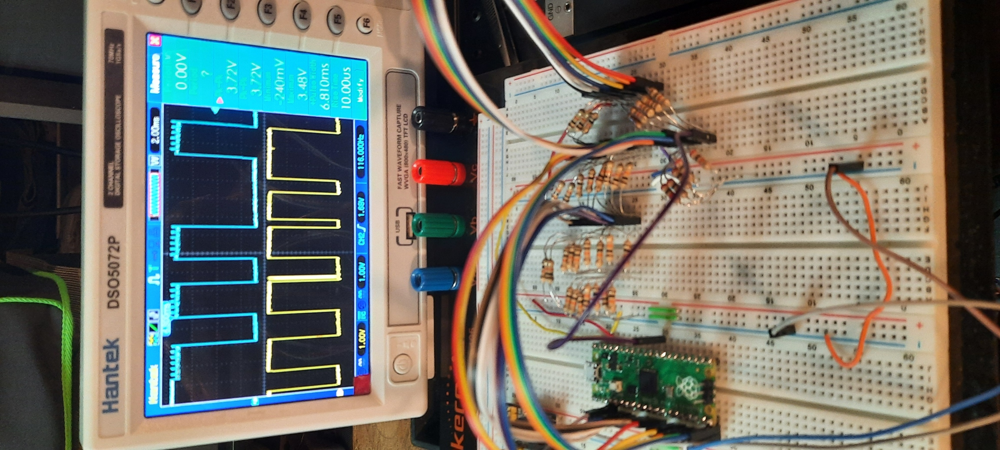

# PicoRAM 2090

A Raspberry Pi Pico (RP2040)-based 2114 SRAM Emulator for the Busch
2090 Microtronic Computer System

 

## About

This emulates the [2114
SRAM](https://de.wikipedia.org/wiki/2114_(SRAM)) found in the [Busch
2090 Microtronic Computer
System](https://github.com/lambdamikel/Busch-2090) - it's a fully
compatible "drop in" replacement.

 

The [2114](manuals/2114.pdf) was a popular and widely used 1024x4 Bit
SRAM chip. It was used in many early arcade games from the late 1970s
and early 1980s. Pinout:

 

The Microtronic is a relatively slow educational 4bit microcomputer,
so timing is not critical. A standard Pico is more than fast enough
for the Microtronic. Note that the Microtronic doesn't utilize the
`CS` (Chip Select) line of the 2114; only `WE` (Write Enable) is used
in addition to the 10 address lines (`A0` to `A9`) and 4 
data lines (`IO/1` to `IO/4`).

 

## Hardware Setup 

The wiring goes as follows:

- `GP2`..`GP11`: address lines `A0`..`A9` (input) 
- `GP12`..`GP15`: data lines `IO/1`..`IO/4` (input/output)
- `GP22`: Write Enable (`WE`), low active (input) 

Simply connect the corresponding Pico `GP` ports to the corresponding
2114 pins; in the original Microtronic, the 2114 is housed in a
special (white) socket, so the chip is easily spotted:

I recommend replacing this socket with a standard DIP socket so that
the PicoRAM 2090 can be connected more easily. I simply used DuPont
cables and a standard (machined) IC 18pin DIP socket; DuPont cables
plug in very firmly and permantely into these.

**You'll need 3.3V to 5V (TTL) level converters.**

For this setup, I simply used a [FREENOVE Breakout Board for Raspberry
Pi
Pico](https://www.amazon.com/dp/B0BFB53Y2N?psc=1&ref=ppx_yo2ov_dt_b_product_details)
which **I thought** already had level converters on board, but this
turns out to be **not** the case (thanks, Hans!) **So you should still
add level converters; this setup is probably not entirely safe and
might damage your Pico in the long run.**

 

 

## A Safer Version with Level Converters  

Whereas the version without the level shifters works, it is probably
not the safest option for Pico longevity. Looking at the oscilloscope,
the peak voltage levels are indeed much too high. Even though the Pico
doesn't seem to care too much (it was running for hours without
damage), it's well out of spec, and probably it won't last very long
like this:

 

 

Hence, *level shifters!* 

I experimented quite a bit with various 3.3 - 5.5 V active level
shifters, utilizing the *TXS0108E chip* as well as the ones with
*discrete MOS-fets and pull-up resistors.* **None of them worked for
the Microtronic!**

I eventually realized that this is due to the unusual hardware setup
in the Microtronic. See, the TMS1600 GPIO lines that address the 2114
(inputs into `A0` to `A9`) are also used for multiplexing the 7segment LED
display, as well as for keyboard matrix scanning!

Moreover, there is no CS signal which would allow me to distinguish
the "real" RAM accesses on `O0 - O3, R1 - R5` from the "inadvertent"
accesses that occur due to LED display and keyboard scanning
activity. In fact, the 2114 just outputs its data for these
"addresses" as well, but they are simply ignored (after all, the
firmware of the Microtronic knows when to read the addressed RAM, and
when not to).

One can see in the Schematics that the output lines specifying the
addresses for the 2114, `O0 - O3, R1 - R5`, are connected to 33 kOhm
pull-down resistors. The electrical levels I got from the
off-the-shelf level converters simply were not compatible with that -
these level converters feature a 5V pull-up resistor, pulling these
lines to high, whereas the pull-down resistors on the Microtronic are
doing the opposite.

Encouraged by discussions with a fellow retro-enthusiast (thanks to
Hans, again), I decided to go with simple voltage dividers for these
address lines instead. I started with the standard 1k-2k divider, but
this caused the LED display to malfunction - segments were now
lightning up when they were not supposed to. To match the existing 33
kOhm pull-down resistors, we then found a 10k-20k divider which solved
the problem for the address lines.

I then tried the same 10k-20k divider for the data
lines. Unfortunately, the resulting data output signals from the Pico
were then unreadable by the TMS1600. Even though the voltage levels
were right, it seemed that the signal currents were now too low. I
hence exchanged these with 1k-2k dividers, and finally everything
started to work properly - resistor hell!

The peak-to-peak voltage levels are still a bit too high (~ 3.6 V),
but we are getting there. I can do one more round of "resistor
tuning":

 

 

This is obviously resistor / voltage-divider hell, but it's only an
experimental breadboard, and I am going to design a proper PCB at some
point when the project is ripe, and the planned features (see below)
have been implemented. It's going to be a real product, eventually.

I feel much more comfortable with the voltage dividers in place
now. This should protect the Pico sufficently.

## Firmware

Checkout
[https://github.com/raspberrypi/pico-setup-windows](https://github.com/raspberrypi/pico-setup-windows/tree/master);
*Visual Studio Code (VSCode)* for Rasperry Pi Pico. This installation
includes a set of Pico examples. Copy the files from the [`src`
directory](./src) into a directory `sram` to your
`pico-examples`. Also add the `add_subdirectory(sram)` to the global
`CMakeLists.txt` in the `pico-examples` directory so that a `Build
All` from VSCode will automatically generate it together with the
other examples.

After a build, you can simple copy the generated `sram.uf2` (see the
`build/sram` sub-directory) to the Pico using the power-on reset USB
method.

## YouTube Video

[Emulating (S)RAM with the Raspberry Pi
Pico!](https://youtu.be/j5Tbw8vmk-s)

## Future Plans / Next Steps 

- add a display and enable save & load of SRAM images to EEPROM / SDCard, turning this into a powerfull SRAM-image based mass storage solution (no more cassette interface needed for saving and loading Microtronic programs) 
- add capability to select different SRAM banks using Microtronic's digitial output ports, turning this into a banked memory expansion for the Microtronic offering up to 15x more RAM

