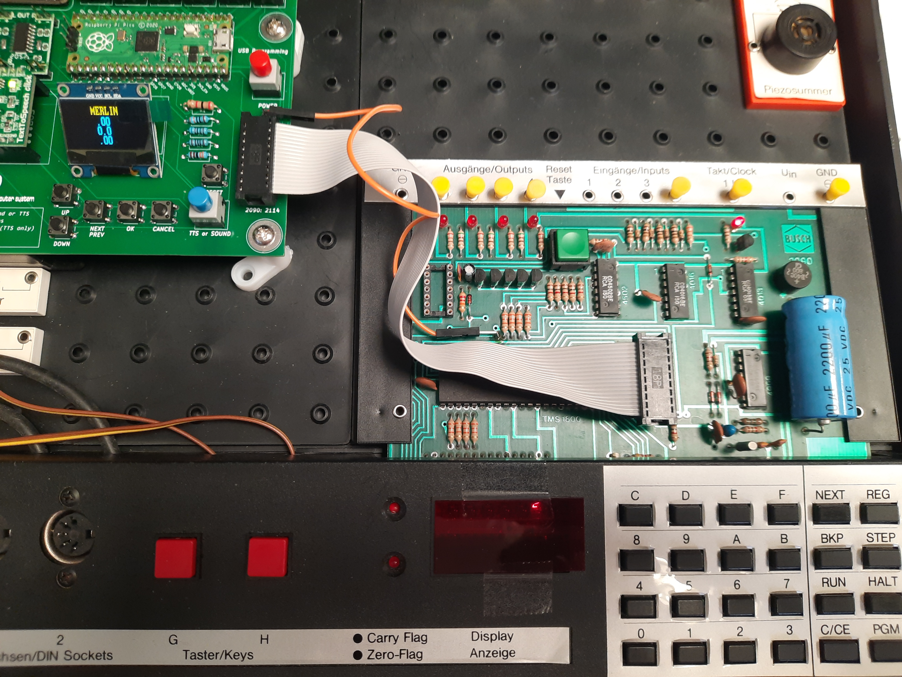
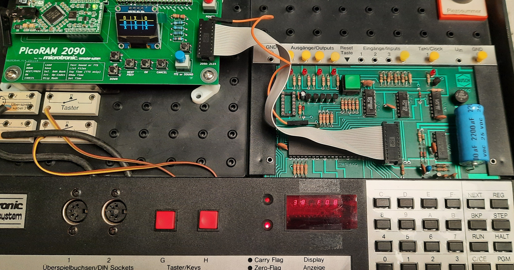
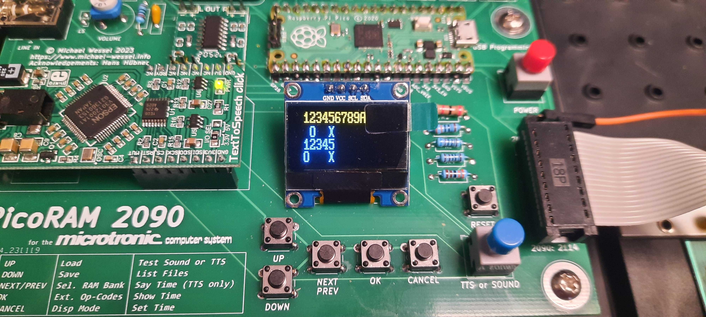

# New Vibe-Coded Programs

A small collection of brand-new games for the Busch Microtronic 2090 + PicoRAM,
**vibe-coded** - written entirely in Microtronic machine code in conversation
with an AI (Anthropic's Claude), and debugged iteratively on real hardware.

They push the PicoRAM further than anything before them. In particular, the
two-bank **human-first Tic-Tac-Toe** is - as far as we can tell - the **first
PicoRAM program to combine all of these at once**:

* **OLED graphics** (the `#` grid drawn with line/char op-codes),
* **TTS speech** ("YOU?", "I WIN", "YOU WIN", "DRAW"),
* **SRAM bank-switching** (`70x`) - the AI lives in one bank, the display+speech
  in another, so neither is cramped by the 256-word limit, and
* a real, from-scratch **game AI** (a board-scanning tactical tic-tac-toe player).

And both Tic-Tac-Toe games appear to be the **first working tic-tac-toe for the
Microtronic at all**: the 1981 Busch manual listing had never been correctly
turned into a running program (the original print has an address typo, and later
attempts were corrupt). We re-derived the authentic 58-word Busch strategy from
the manual and verified it against the manual's own worked example.

> Everything here uses only existing PicoRAM extended op-codes - **no firmware
> changes required.**

---

## MERLIN  (`merlin/`)

A graphical 3x3 **Merlin / Lights-Out** puzzle (titled "MERLIN" on the OLED).
Turn all nine cells ON (`O` = on, `.` = off) by pressing cells, each of which
toggles a Merlin-style region. Short key beep + a victory melody (set PicoRAM to
SOUND mode). The keypad's left 3x3 block maps straight onto the board
(`8 9 A` / `4 5 6` / `0 1 2` -> top/middle/bottom). `F` = new random puzzle.

*Built from a corrupt original:* fixed the keys, made the beep short, sped the
melody up ~19x, and switched to overwriting the board instead of clear+redraw so
it no longer blinks. One bank, no nested `CALL`s. See `merlin/PICO_WIPEON_README.txt`.

## MERLIN 2  (`merlin-2/`)

MERLIN with **difficulty**: at the start you press one key to set your **move
budget** (8..F = 8..15 moves, easier; 1..7 = expert). Solve it before the move
counter (on the red 7-segment LED) hits your budget, or you get a **sad
falling-D-minor melody** and a new game. Adds the budget/loss logic and a second
melody to v1. One full bank. See `merlin-2/PICO_MERLIN2_README.txt`.

## Tic-Tac-Toe - computer-first  (`tic-tac-toe-computer-first/`)

The computer opens in the center and plays the **authentic Busch look-ahead
strategy** (the 58-word program from Manual Part 2, preserved verbatim),
wrapped in OLED graphics and speech. It does not lose. Keypad `8 9 A / 4 5 6 /
0 1 2` selects cells (spiral numbering, matching the keypad block); it says
"YOU?" on your turn and "I WIN" / "DRAW" at the end. Includes the `.asm` source
(`titato_cf.asm`, assembled with `dev-support/masm.py`). 247 words, one bank.

## Tic-Tac-Toe - human-first, two-bank  (`tic-tac-toe-human-first/`)

**The showcase.** You move first; the computer plays second with a real
**board-scanning tactical AI** (win -> block -> center -> corner -> side). It's a
genuinely good opponent - across all 489 lines of play it wins 350, draws 127,
and can only be beaten by a deliberate two-corner fork (12 lines).

A second-player AI needs to actually read the board (unlike the first-player
Busch program, which is compact arithmetic), and that plus the graphics doesn't
fit in 256 words. So it's split across **two SRAM banks**:

* **bank 0** = the AI (`PICO_TITATO_HF_B0.MIC`),
* **bank 1** = the OLED redraw, the speech, and the keypad input/mapping
  (`PICO_TITATO_HF_B1.MIC`).

They hand control back and forth with a tiny `70x / NOP / GOTO` stub at aligned
addresses; the registers carry the game state across the switch. Load B0 into
bank 0 and B1 into bank 1, set TTS mode, start at address 00. Keypad block
`8 9 A / 4 5 6 / 0 1 2` maps to the grid rows. Includes both `.asm` sources and a
simpler single-bank LED-only variant (`PICO_TITATO_HF.MIC`). See
`tic-tac-toe-human-first/PICO_TITATO_HF_2BANK_README.txt`.

## BLOCKADE  (`blockade/`)

The two-track strategy game from the Busch 2094 "Computerspiele" booklet, given an
OLED makeover. Two lanes - Bahn 1 (fields 1-A) and Bahn 2 (fields 1-5) - each with a
computer piece (O) and yours (X) starting at opposite ends; a move is the lane number
then the target field, and you win by leaving equal gaps on both lanes (a Nim-style
game the first player can always win). The OLED draws each lane as its row of field
numbers with the pieces beneath, so you read the target field and watch the gaps
close; it speaks "YOU WIN" / "I WIN" at the end.

The game logic (00-87) is the **authentic Busch listing**, transcribed and verified
word-for-word against `anl2094.pdf` - an earlier GPT "graphical" version had the right
core but a broken OLED wrapper, so only the wrapper was redone. It draws the static
lane numbers **once** and then only erases/redraws the four pieces each move (their
previous columns kept in spare registers, positions fed to the cursor via the `3Fx`
op), so play is fast and flicker-free. One bank, exactly 256 words. See
`blockade/PICO_BLOCKADE_GFX_README.txt`.

---

## Dev support  (`dev-support/`)

The tools used to build and verify all of the above - a Microtronic **assembler**
(`masm.py`) and a **two-bank simulator** (`mtsim.py`) that renders the OLED and
captures speech so a whole game can be played off-device. See
[`dev-support/README.md`](dev-support/README.md).

## Notes for PicoRAM hackers

A few non-obvious things these programs discovered, in case you build your own:

* **Bank switch `70x` can't set the PC** - after it the PC is just +1, and there
  is a one-instruction **prefetch** (the +1 word still runs from the *old* bank).
  A reliable handoff is therefore `70x ; NOP ; GOTO target` at an address that
  lines up in both banks.
* **`50x` ops are async/buffered** on the Pico's 2nd core. Fire a `70x` right
  after a burst of draw/speech and the Pico can miss it - put a short wait loop
  before switching back.
* **Compare carry is no-borrow**: `CMPI n,r` sets carry when `R[r] > n`
  (so `BRC` after a compare branches on "greater", not "less").
* **`50x` arguments are the equal-nibble `0xx` words** (`MOV x,x`, value x) - CPU
  no-ops that the PicoRAM swallows as args. A stray one desyncs the arg stream;
  `3Fx` is a global CPU-hijack (only safe as a `50x` arg).
* The OLED is **128x32**; text cells are 8x8, so characters land on 8-pixel rows
  and `print_char` upper-cases (no lowercase glyphs). Lines are true pixels.
